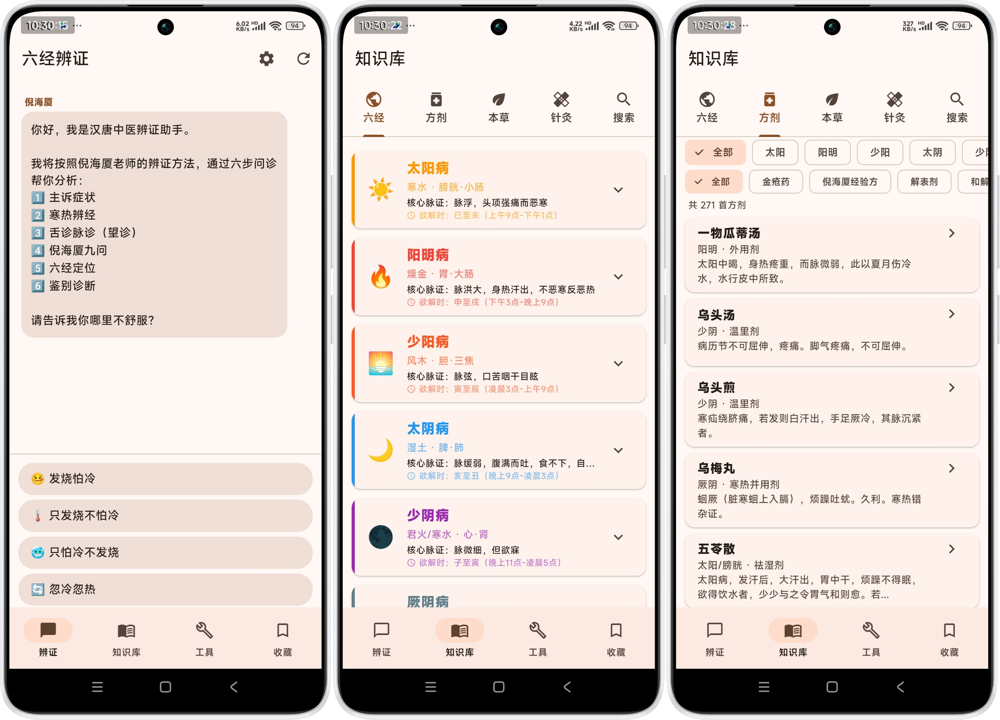
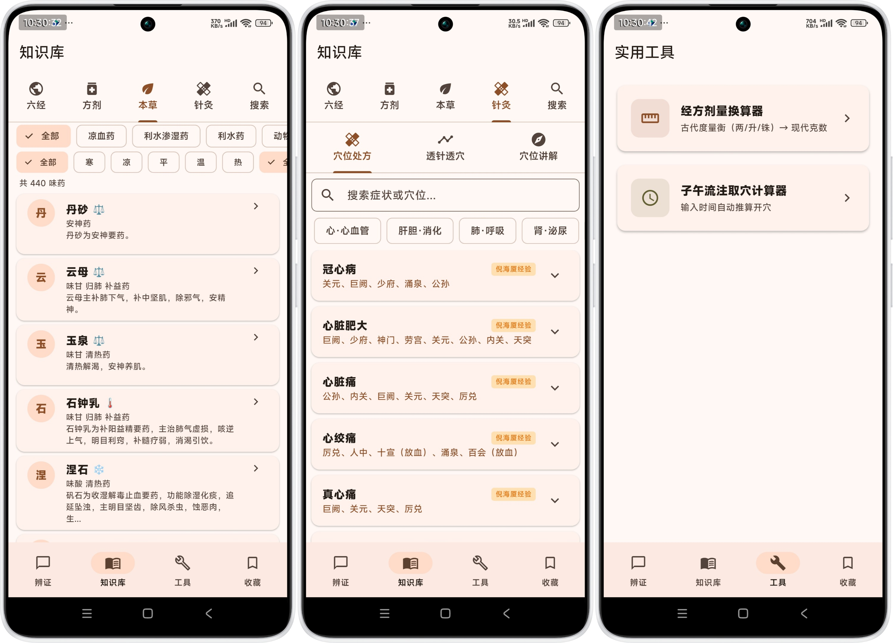

<div align="center">


# 汉唐中医

**基于倪海厦六经辨证体系的中医诊断助手**

离线可用 · 完全免费 · 开箱即用

[](https://github.com/jangviktor-web/nihaixia-app/releases/latest)
[](https://flutter.dev)
[](https://dart.dev)
[]()
[](LICENSE)
[](https://github.com/jangviktor-web/nihaixia-app/stargazers)

<br/>

**[🌐 落地页](https://jangviktor-web.github.io/nihaixia-app/)** · **[📥 下载 APK](https://github.com/jangviktor-web/nihaixia-app/releases/latest)** · **[📖 文档](#-技术架构)** · **[🗺️ Roadmap](#️-roadmap)**

</div>

---

## 📷 截图

<div align="center">

**问诊引导 · 六经速查 · 方剂速查**



**本草速查 · 针灸穴位 · 实用工具**



</div>

---

## ✨ 功能特性

| 功能 | 说明 | 数据规模 |
|:---|:---|:---:|
| 🩺 **六经辨证诊断** | 智能问诊引导，自动判断太阳/阳明/少阳/太阴/少阴/厥阴 | 6经 |
| 📋 **完整处方生成** | 自动显示组成、剂量、煎服法、禁忌，推荐经方加减 | 23条规则 |
| 🔍 **鉴别诊断** | 自动对比相似证型的关键区别，辅助精准辨证 | 26对 |
| 📚 **方剂速查** | 支持搜索、六经筛选、分类筛选，离线查阅 | 271首 |
| 🌿 **药物速查** | 支持搜索、分类/性味/归经三筛选 | 345味 |
| 📈 **诊断历史趋势** | 六经传变可视化，自动检测"由表入里"/"由里出表" | — |
| ⏰ **子午流注取穴** | 输入时间自动推算开穴 | 361穴 |
| 🔧 **经方剂量换算** | 古代度量衡（两/升/铢）→ 现代克数 | — |
| 🔄 **应用内更新** | 设置中一键检测GitHub新版本，支持下载安装 | — |
| ⚙️ **诊断设置** | 默认性别/诊断详细度/自动复制处方，个性化问诊体验 | 3项 |
| 💾 **数据管理** | 清除历史/导出收藏/清理缓存，本地数据完全掌控 | — |

---

## 📱 下载安装

```bash
# 方式一：直接下载 APK
# 前往 Releases 页面下载最新版
https://github.com/jangviktor-web/nihaixia-app/releases/latest

# 方式二：从源码构建
git clone https://github.com/jangviktor-web/nihaixia-app.git
cd nihaixia-app
flutter pub get
flutter build apk --release
```

> 支持 Android 6.0+，APK 约 52MB，无需联网，无需注册。

---

## 🏗️ 技术架构

```
lib/
├── engine/                          # 诊断引擎
│   ├── diagnostic_engine.dart       #   六经辨证状态机
│   └── diagnostic_rules.dart        #   诊断规则（合病·鉴别·加减）
├── models/                          # 数据模型
│   ├── diagnosis.dart               #   诊断结果 + 处方 + 加减
│   ├── formula.dart                 #   方剂模型
│   └── herb.dart                    #   药物模型
├── data/                            # 数据层
│   ├── formula_repository.dart      #   方剂仓库（4级匹配策略）
│   ├── herb_repository.dart         #   药物仓库
│   └── database_helper.dart         #   SQLite 持久化
├── screens/                         # UI 界面
│   ├── chat_screen.dart             #   对话式诊断
│   ├── knowledge_screen.dart        #   方剂/药物速查
│   ├── diagnosis_history_screen.dart#   诊断历史趋势
│   └── tools_screen.dart            #   实用工具集
└── assets/data/                     # 离线数据
    ├── formulas.json                #   271首方剂
    ├── herbs.json                   #   345味药物
    └── acupoints.json               #   穴位数据
```

<details>
<summary><b>🔧 核心技术栈</b></summary>

| 层级 | 技术 | 用途 |
|:---|:---|:---|
| UI | Flutter + Material Design 3 | 跨平台界面 |
| 状态 | Stateful Widget | 轻量状态管理 |
| 存储 | SQLite (sqflite) | 本地数据持久化 |
| 数据 | 离线 JSON | 方剂/药物/穴位 |
| 引擎 | 自研 DiagnosticEngine | 六经辨证状态机 |

</details>

<details>
<summary><b>📐 诊断引擎设计</b></summary>

**4级方剂匹配策略：**
1. 精确匹配 `name`
2. 别名匹配 `alias`
3. 斜杠分割匹配（如"小柴胡汤/大柴胡汤"取第一个）
4. 子串匹配（如"桂枝加厚朴杏仁汤"匹配"桂枝汤"）

**合病检测：** 6经评分 → 精确条件匹配 → 方剂覆盖
**鉴别诊断：** 经 + 证型关键词 + 问诊答案 → 26对鉴别

</details>

---

## 📖 六经辨证体系

<div align="center">

| 经 | 主证 | 主方 | 要点 |
|:---:|:---|:---|:---|
| ☀️ **太阳** | 脉浮、头项强痛、恶寒 | 桂枝汤 / 麻黄汤 | 表证第一关 |
| 🔥 **阳明** | 但热不寒、胃家实 | 白虎汤 / 承气汤 | 阳明无死证 |
| 🌅 **少阳** | 口苦咽干目眩、往来寒热 | 小柴胡汤 | 半表半里，但见一证便是 |
| 🌙 **太阴** | 腹满吐利、食不下 | 理中汤 / 四逆汤 | 脾虚寒湿 |
| 🌑 **少阴** | 脉微细、但欲寐 | 四逆汤 / 真武汤 | 心肾阳虚，急温之 |
| ☯️ **厥阴** | 消渴、气上撞心、寒热错杂 | 乌梅丸 / 当归四逆汤 | 阴之尽，寒热并结 |

</div>

---

## 🗺️ Roadmap

- [x] 六经辨证智能诊断
- [x] 完整处方生成（组成+剂量+煎服法+禁忌）
- [x] 经方加减法（23条规则）
- [x] 合病扩展（14种覆盖）
- [x] 鉴别诊断扩展（26对场景）
- [x] 诊断历史趋势图（六经传变可视化）
- [x] 方剂/药物速查增强（搜索+筛选）
- [x] 子午流注取穴计算器
- [x] 经方剂量换算器
- [x] 应用内更新检测（GitHub Releases）
- [x] 诊断设置增强（默认性别/详细度/自动复制）
- [x] 数据管理（清除历史/导出收藏/清理缓存）
- [ ] 舌诊 AI 辅助（TFLite 本地模型）
- [ ] 脉诊辅助（脉象分类）
- [ ] 方剂对比功能
- [ ] 导出 PDF 诊断报告

---

## 📚 参考资料

| 来源 | 内容 |
|:---|:---|
| 倪海厦《人纪》 | 伤寒论、金匮要略、黄帝内经、针灸大成、神农本草经 |
| 张仲景《伤寒论》 | 六经辨证体系 |
| 张仲景《金匮要略》 | 杂病辨证 |
| 《神农本草经》 | 药物性味归经（345种） |

---

## 📝 更新日志

### v1.5.0 (2026-06-12)

**新增功能：设置面板全面升级**

| 功能 | 说明 |
|:---|:---|
| **默认性别设置** | 可预设性别（男/女/不设置），设置后问诊时自动跳过性别选择，加快诊断流程 |
| **诊断详细度** | 简单模式：只显示六经、证型、方剂和组成；详细模式：显示完整处方、鉴别诊断、脉舌矛盾、用药铁律、汗法禁忌、传经预警、调护建议等 |
| **自动复制处方** | 开启后，诊断完成时自动将处方复制到剪贴板，方便直接发送给药房抓药 |
| **清除诊断历史** | 一键清除所有本地诊断记录，带确认对话框防止误删 |
| **导出收藏** | 将收藏的辨证结果导出为格式化文本，通过系统分享发送（微信/邮件等） |
| **清理缓存** | 清理应用临时文件，释放手机存储空间 |
| **关于页面** | 显示应用版本、功能特色、致谢信息 |
| **检测更新** | 连接GitHub项目，一键检查是否有新APK可下载 |

**设置面板布局（4个区域）：**
- 外观：暗黑模式、字体大小
- 诊断：默认性别、诊断详细度、自动复制处方
- 数据管理：清除历史、导出收藏、清理缓存
- 其他：关于、检测更新

**技术改进：**
- SettingsRepository扩展3个新字段（defaultGender, diagnosticLevel, autoCopyPrescription）
- DiagnosticEngine.getTenQuestions()支持defaultGender参数，自动跳过性别问题
- 诊断结果展示支持simple/detailed两种模式
- 174个测试全部通过

---

### v1.4.0

- 应用内更新检测功能（GitHub Releases API）
- 诊断引擎优化（113方六经辨证公式测试验证）

---

### v1.3.0

- 完整处方生成（组成+剂量+煎服法+禁忌+加减建议）
- 鉴别诊断扩展（26对场景）
- 合病扩展（14种覆盖）
- 脉舌矛盾警告
- 真寒假热/真热假寒鉴别
- 用药铁律与汗法禁忌
- 传经预警系统

---

### v1.2.0

- 诊断历史趋势图（六经传变可视化）
- 方剂/药物速查增强（搜索+筛选）

---

### v1.1.0

- 子午流注取穴计算器
- 经方剂量换算器

---

### v1.0.0

- 初始版本
- 六经辨证智能诊断
- 方剂速查（271首）
- 药物速查（345味）
- 穴位数据（361穴）

---

## 🤝 Contributing

欢迎提交 Issue 和 Pull Request！

1. Fork 本仓库
2. 创建特性分支 (`git checkout -b feature/amazing-feature`)
3. 提交更改 (`git commit -m 'feat: add amazing feature'`)
4. 推送分支 (`git push origin feature/amazing-feature`)
5. 创建 Pull Request

---

## 📄 License

[MIT License](LICENSE) © 2026 jangviktor-web

---

<div align="center">

> 「中医很简单，就是阴阳气血。你搞懂了，一通百通。」—— 倪海厦

**⭐ 如果这个项目对你有帮助，请给个 Star！**

</div>
